# Task Manager

## The web application designed for task management

This is my first Django project, where I developed a Task Manager web application. Although it is a study project, it is fully operational and can be freely used.


## ⚡️&nbsp; Deployment

### [Task Manager](https://it-company-task-manager-qd3p.onrender.com)
>**Please note:** You might see an error due to the database being in an idle state. It usually takes up to 50 seconds for the website to start working properly.

>To access the website, please use the following credentials: <br> - **Username:** Marty_McFly <br> - **Password:** 1qazcde3

<br>

## 🔌 &nbsp; Installation 

1. Install Python 3. 
2. Clone the repository and set up the virtual environment:
    ```shell
    git clone https://github.com/mykyta-so/task-manager
    cd task-manager
    python3 -m venv venv
    source venv/bin/activate (on macOS)
    venv\Scripts\activate (on Windows)
    pip install -r requirements.txt
    ```
3. To create an admin (superuser) account for accessing the Task Manager, run:
   ```shell
   python manage.py createsuperuser
    ```
   Follow the prompts to set a username, email, and password.

<br>

## 💾 &nbsp; Populate Test Database

> **Important** <br> Before populating the database, ensure that it is empty except for the superuser you created during the installation. This will help avoid any issues during the population process.

<br>
To populate the database, run:

```shell
python seed.py
```

<br>
The seed.py script populates the database with the following test data:

- 11 Workers
- 7 Work Positions
- 10 Task Types
- 5 Task Priorities
- 100 Tasks

<br>

## 👾 &nbsp; Overview

### Database diagram
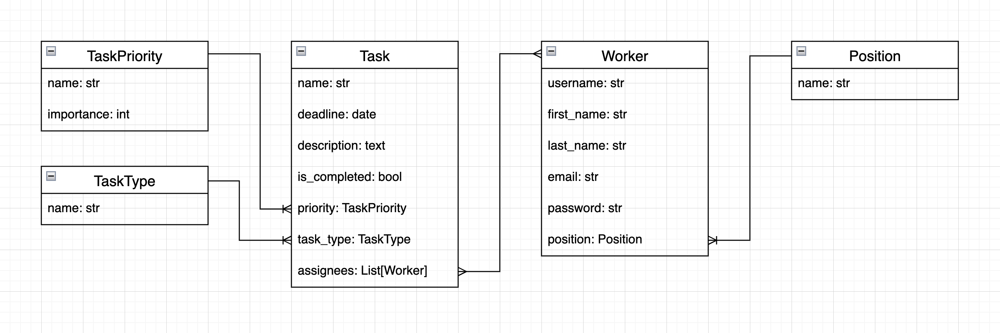

<br>

### Dashboard
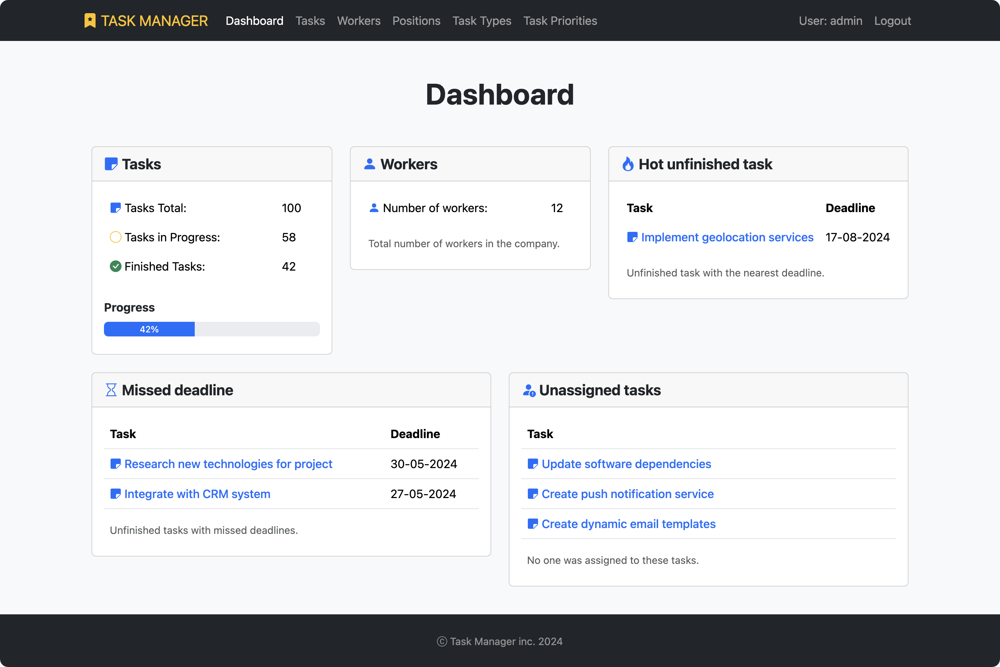

<br>

### Dashboard with no data
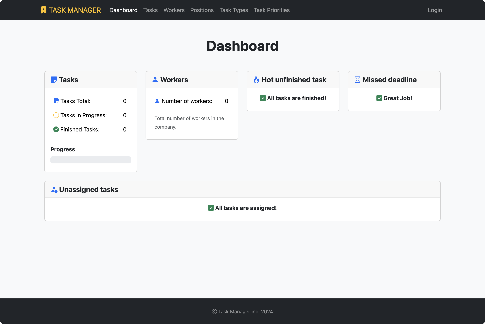

<br>

### Dashboard on small screens
Although I developed Task Manager as a web application for desktop users, I also aimed to make it look good on small screens.
<br>

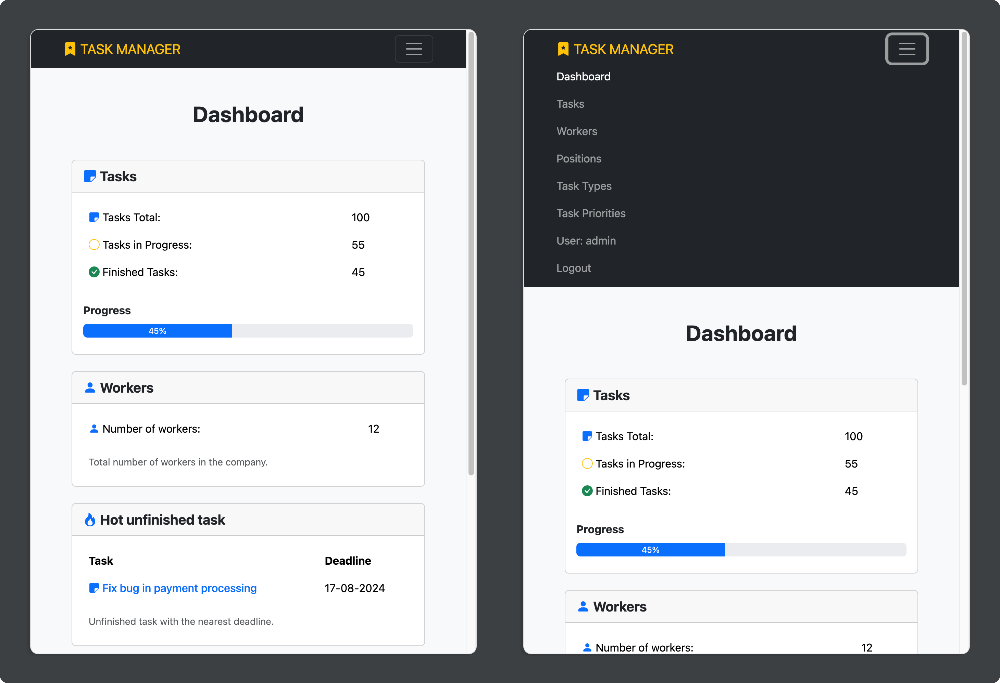

<br>

### Tasks list page
On the Tasks page, users can:
- View a list of all tasks, including task priority, task type, number of assigned workers, completion status, and deadline.
- Easily toggle the completion status of the tasks by clicking on the status icon.
- View detailed task information by clicking on the task name.
- Sort tasks by any column in both ascending and descending order.
- Search for tasks by name.
- Create new tasks.
- Update existing tasks.
- Delete tasks.
<br>

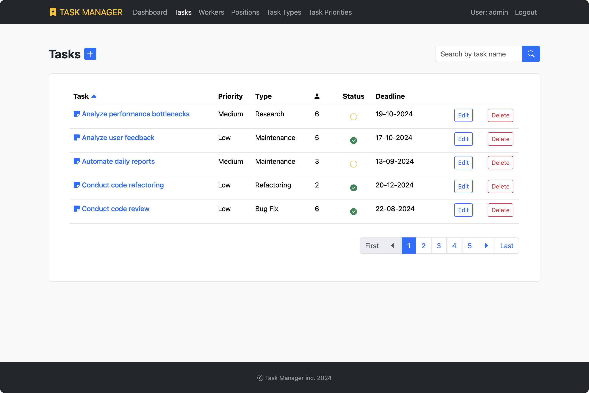

<br>

### Task detail page
On the Task Detail page, users can:
- View all information related to the task.
- Easily assign or unassign workers.
- Change the completion status of task.
<br>

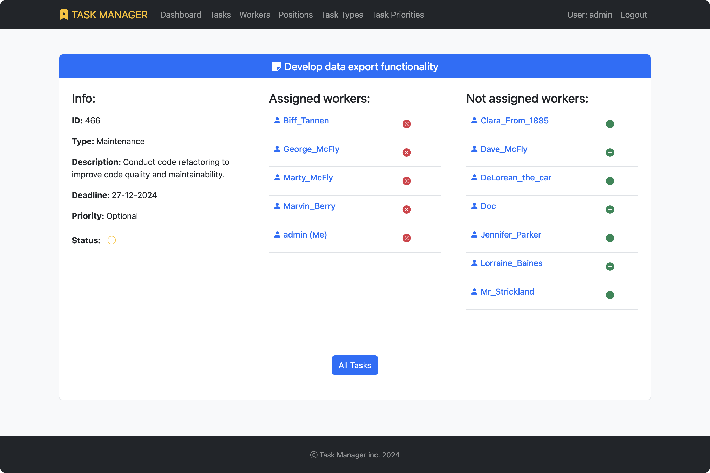

<br>

### Task create page
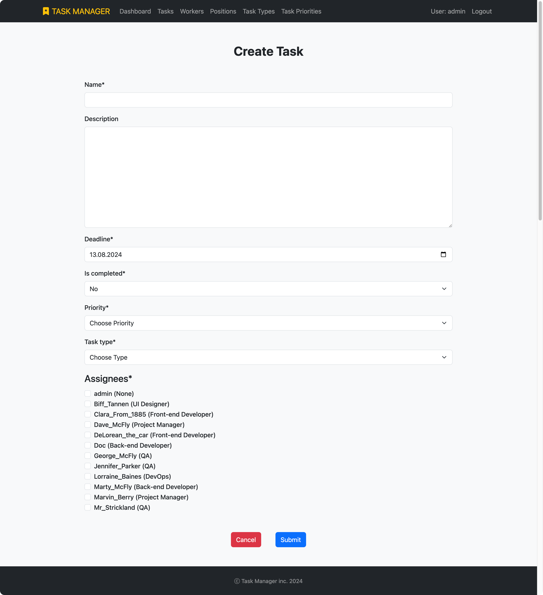

<br>

### Task delete page
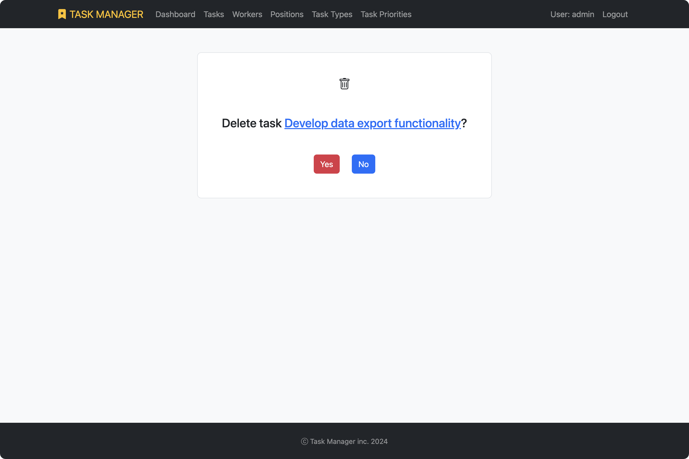

<br>

### Workers list page
On the Workers page, users can:
- View a list of all workers, including their first name, last name, position in the company, and the number of assigned tasks.
- View detailed worker information by clicking on the worker username.
- See `(Me)` at the end of the username of the currently logged-in user.
- Sort workers by any column in both ascending and descending order.
- Search for worker by username.
<br>


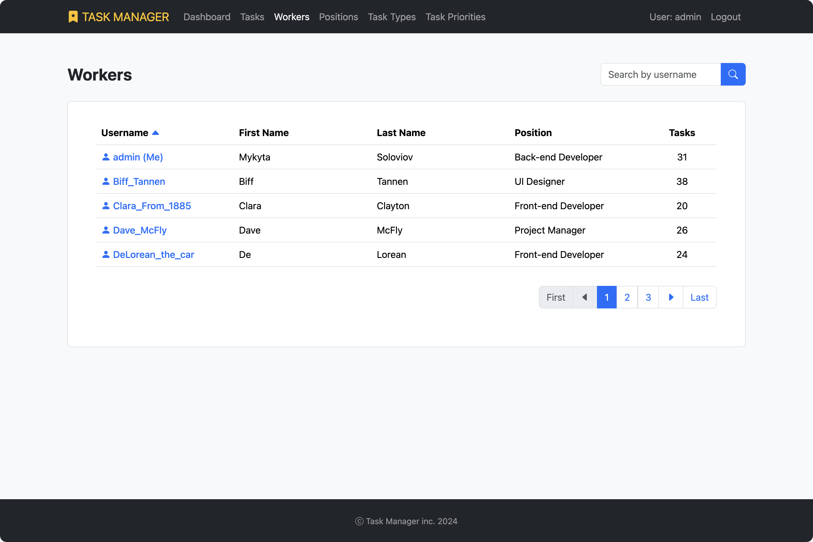

<br>

### Worker detail page
On the Worker Detail page, users can:
- View all information related to the worker.
- Unassign the worker from specific tasks.
- Change the completion status of tasks.
<br>

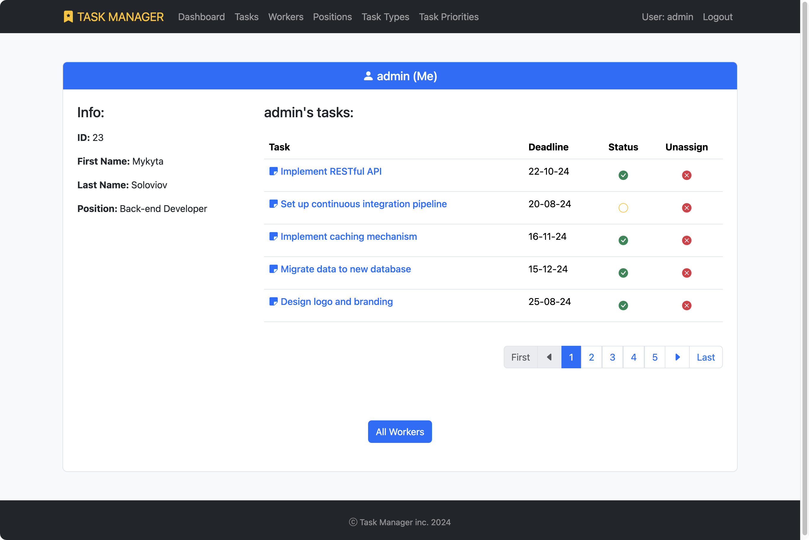

<br>

### Positions
The Positions, Task Types, and Task Priorities pages share some similarities.
<br>

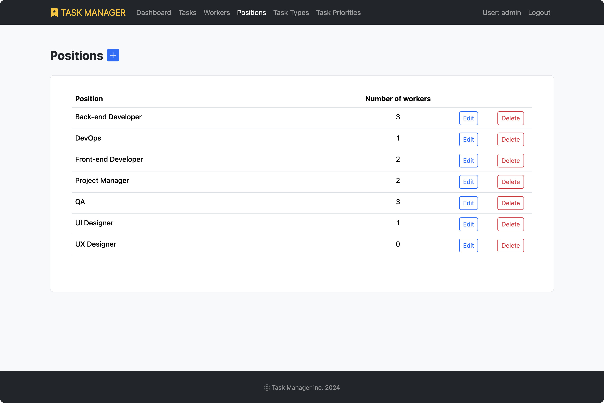

<br>

### Pagination
I aimed to make pagination convenient for users, so I implemented it in this way. 
<br>

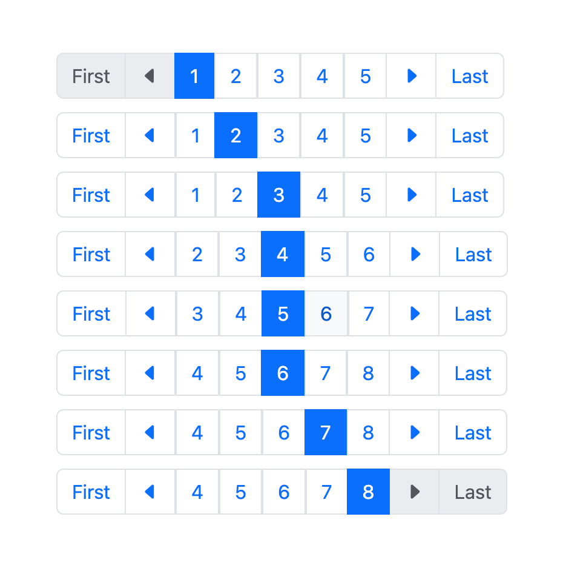

<br><br>


### Ordering
On the Tasks and Workers pages, users can sort the table by any column in both ascending and descending order by clicking on the column name. Here’s a detailed overview of how it works.
<br>

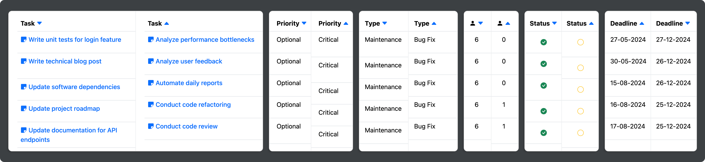

<br>

## 😵‍💫&nbsp; Solved Problems

>I understand that `README.md` file should be descriptive and short, but since this is my first Django project, I want to mention some problems I encountered during development.

<br>

1. I wanted to use Bootstrap’s `input-group` class to combine the search field and button into a single component, but it didn't work. I was able to achieve this only after discovering that Django forms wrap the input field in an additional `<div> </div>`.
   <br>
   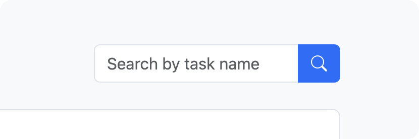
   
   <br>
   
   To eliminate unwanted `<div> </div>`, I decided to use a `for` loop:
   ```
   <form method="get" action="" class="input-group" >
     
       {{ input_field }}
     
     <button class="btn btn-primary" type="submit"><i class="bi bi-search"></i></button>
   </form>
   ```
   
   <br><br>

2. How to implement tasks ordering on Tasks list page by the number of workers assigned to each task? The `annotate()` function came in handy for this purpose:
   ```
   def get_queryset(self):
      ordering = self.request.GET.get("order", "id")
      queryset = Task.objects.select_related(
            "priority",
            "task_type",
         ).prefetch_related(
            "assignees",
         ).annotate(
            Count("assignees")
         ).order_by(
            ordering
         )
   ```
      
   <br><br>

3. To enable logical ordering of Tasks by priority, I decided to create a separate Priority model with a unique integer value representing its importance:
   ```
   class TaskPriority(models.Model):
       importance = models.PositiveSmallIntegerField(unique=True,)
       name = models.CharField(max_length=255, unique=True,)
   ```
      
   <br><br>

4. To assign and unassign workers to tasks, I created a class based view called `AssignUnassignWorkerView`. I wanted to use this functionality on different pages (`TaskDetailView` and `WorkerDetailView`), but I needed to determine which template the view should render after assigning or unassigning a worker. I decided to pass the current template to the `AssignUnassignWorkerView` through the `context` for rendering.
   
   <br>html: `<input type="hidden" name="current_url" value="{{ request.get_full_path }}">`
   
   <br>view: `return redirect(request.POST.get("current_url"))`

   <br><br>

5. Implementing pagination for a worker’s assigned tasks in WorkerDetailView was a bit challenging:
   ```
   class WorkerDetailView(LoginRequiredMixin, generic.DetailView):
    model = Worker
    queryset = Worker.objects.select_related(
        "position",
    ).prefetch_related(
        "tasks",
    )

    def get_context_data(self, *, object_list=None, **kwargs):
        """
        Paginates tasks related to a specific worker in the worker detail view.
        """

        context = super(WorkerDetailView, self).get_context_data(**kwargs)
        worker = kwargs.get("object")
        page_num = self.request.GET.get("page", 1)
        worker_tasks = worker.tasks.all()
        paginator = Paginator(worker_tasks, 5)

        context.update({
            "page_obj": paginator.get_page(page_num),
            "is_paginated": paginator.num_pages > 1,
        })
        return context
    ```
   
   <br>I also had to make some modifications to the pagination HTML code to work with both Django’s built-in pagination in `ListView` and this custom implementation in `DetailView`:
   <br>`paginator.num_pages -> page_obj.paginator.num_pages`
   
<br>

## 🖋️ &nbsp; Author
 Mykyta Soloviov <a href="https://github.com/mykytaso">@mykytaso</a>
